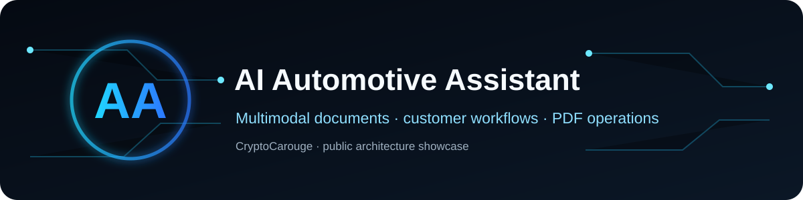
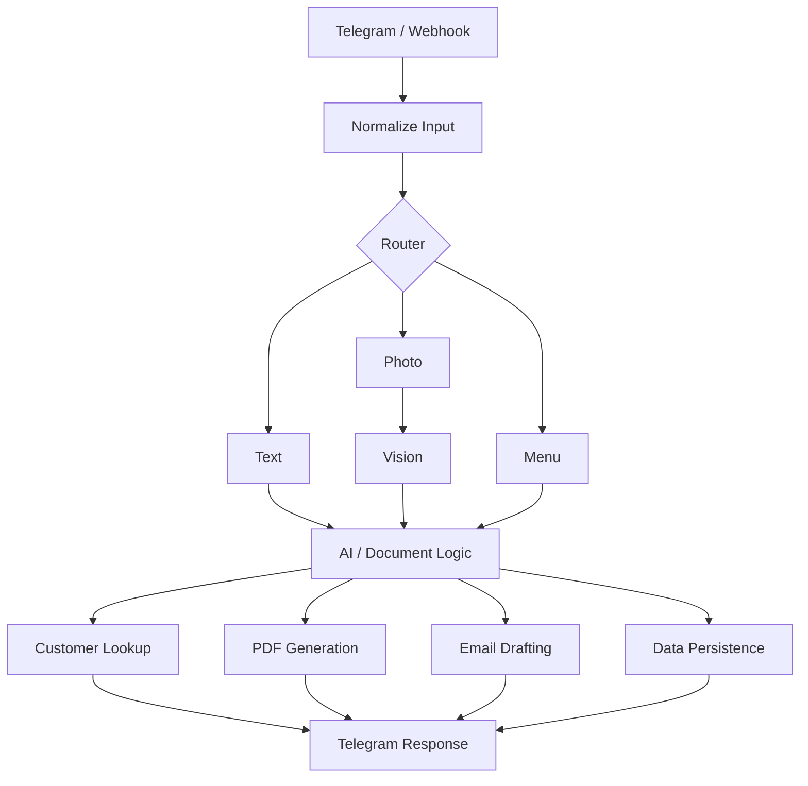

# AI Automotive Business Assistant

A multimodal business-operations assistant built with n8n, Telegram, OpenAI, Google Sheets and Gotenberg.

The original private workflow was designed around automotive operations. This public edition documents the reusable architecture with no client data, contact details, private document IDs or credentials.

## What it demonstrates

- Telegram-based operational interface
- Text and photo input
- Vision-assisted document parsing
- Structured extraction and customer lookup
- PDF generation through Gotenberg
- Google Sheets persistence
- AI-assisted email drafting
- Menu/mode routing
- Operational counters and settings
- Post-document follow-up flows

## Architecture

## Engineering approach

Conversational AI is separated from operational actions. Parsing, routing, data lookup, PDF generation and persistence are explicit stages instead of being hidden inside a single prompt.

## Security boundary

Not included: customer records, emails/phone numbers, live Sheet identifiers, chat IDs, private webhook endpoints, API credentials or production workflow JSON.

## Status

Public architecture showcase of a private business-automation system.
